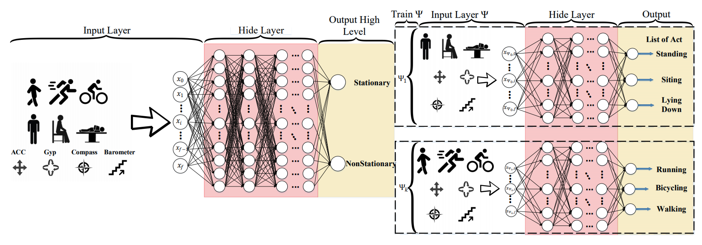

|arxiv|   |gitter|  |researchgate|  |GitHublicense| |twitter|

Referenced paper : `HHAR-net: Hierarchical Human Activity Recognition using Neural Networks <https://arxiv.org/abs/2010.16052>`__

HHAR-net: Hierarchical Human Activity Recognition using Neural Networks
=======================================================================

Activity recognition using built-in sensors in smart and wearable devices provides great opportunities to understand and detect human behavior in the wild and gives a more holistic view of individuals' health and well being. Numerous computational methods have been applied to sensor streams to recognize different daily activities. However, most methods are unable to capture different layers of activities concealed in human behavior. Also, the performance of the models starts to decrease with increasing the number of activities. This research aims at building a hierarchical classification with Neural Networks to recognize human activities based on different levels of abstraction. We evaluate our model on the Extrasensory dataset; a dataset collected in the wild and containing data from smartphones and smartwatches. We use a two-level hierarchy with a total of six mutually exclusive labels namely, "lying down", "sitting", "standing in place", "walking", "running", and "bicycling" divided into "stationary" and "non-stationary". 

==========
Citations:
==========

----

.. code::

    @inproceedings{HHAR2020,
        title={HHAR-net: Hierarchical Human Activity Recognition using Neural Networks},
        author={Fazli, Mehrdad and Kowsari, Kamran and Gharavi, Erfaneh and Barnes, Laura and Doryab, Afsaneh},
        booktitle={Intelligent Human Computer Interaction: 12th International Conference, IHCI 2020, Daegu, South Korea, December 24--26, 2020, Proceedings},
        organization={Springer Nature}
    }

.. |researchgate| image:: https://img.shields.io/badge/ResearchGate-HHAR_net-blue.svg?style=flat
   :target: https://www.researchgate.net/publication/344934245_HHAR-net_Hierarchical_Human_Activity_Recognition_using_Neural_Networks
   
.. |GitHublicense| image:: https://img.shields.io/badge/licence-AGPL-blue.svg
   :target: ./LICENSE
.. |arxiv| image:: https://img.shields.io/badge/arXiv-2010.16052-red.svg
    :target: https://arxiv.org/abs/2010.16052
.. |twitter| image:: https://img.shields.io/twitter/url/http/shields.io.svg?style=social
    :target: https://twitter.com/intent/tweet?text=HHAR-net:%20Hierarchical%20Human%20Activity%20Recognition%20using%20Neural%20Networks%0aGitHub:&url=https://github.com/mehrdadfazli/Hierarchical-DNN-Activity-Recognition&hashtags=DeepLearning,ActivityRecognition,MachineLearning,deep_neural_networks,DataScience

.. |gitter| image:: https://badges.gitter.im/Join%20Chat.svg
   :target: https://gitter.im/HHAR-net/community
